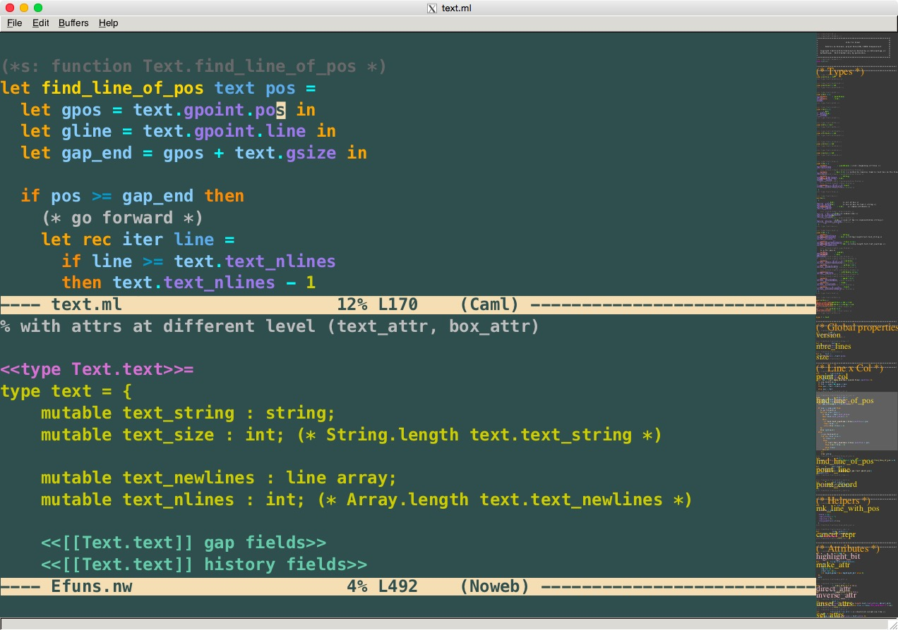

# Efuns

An Emacs clone written entirely in OCaml, using GTK/Cairo for rendering.

Efuns was written originally by Fabrice Le Fessant
(INRIA Rocquencourt, FRANCE) in 1999.

It was forked by Yoann Padioleau in 2015 who took over its maintenance
and added many features (see `changes.org`, `authors.txt`, and the
screenshot below).



## Building

### Prerequisites

OCaml 4.14+ (via opam >= 2.1), gcc, git, curl, pkg-config.

On Ubuntu/Debian:
```bash
apt-get install build-essential pkg-config opam curl libpcre3-dev libpcre2-dev libgmp-dev libev-dev libcurl4-gnutls-dev libcairo2-dev libgtk2.0-dev
```

On macOS:
```bash
brew install opam pkg-config cairo gtk+
```

### Quick start

```bash
git clone --recurse-submodules https://github.com/aryx/efuns
cd efuns
./configure     # installs opam deps and sets up tree-sitter (run infrequently)
make            # routine build
make test       # run tests
```

### Docker

A reference build using Ubuntu is provided:

```bash
docker build -t efuns .
```

## Usage

```bash
efuns --help
efuns <file>
```

## Inspiration

Efuns is part of [Principia Softwarica](https://github.com/aryx/principia-softwarica),
a series of literate-programming books that explain with full details the source
code of all the essential programs used by a programmer (kernel, shell, compiler,
editor, debugger, etc.). The programs chosen for Principia must be small and
elegant enough to explain completely — efuns, at under 15,000 lines, fits that
criterion while covering all the essential concepts of a screen editor.

Efuns is an Emacs clone — it shares Emacs's concepts of buffers, windows,
modes, and keymaps. A key design difference from GNU Emacs is that efuns has
no separate extension language: in Emacs the core is C and extensions are
Emacs Lisp, but with OCaml as the implementation language you can extend the
editor simply by adding a module and recompiling.

Other Emacs clones and editors that were considered as alternatives for the book:

- **[GNU Emacs](https://www.gnu.org/software/emacs/)** — The canonical Emacs and the source of the core concepts (buffers, windows, modes, keymaps, minibuffer, buffer-local variables). Too large to study as a whole — `xdisp.c` alone is 30,000 lines, more than all of efuns.
- **[Qemacs](https://bellard.org/qemacs/)** — Fabrice Bellard's small Emacs clone in C, with impressive Unicode and HTML rendering support.
- **[mg](https://github.com/hboetes/mg)** — Micro GNU Emacs (~20,000 LOC in C). A minimal, portable Emacs clone.
- **[Sam](http://sam.cat-v.org/)** and **[Acme](http://acme.cat-v.org/)** — Rob Pike's Plan 9 editors, which take a different approach: structural regular expressions (Sam) and a mouse-driven tiling interface (Acme).
- **[Yi](https://github.com/yi-editor/yi)** — An editor written in Haskell, exploring similar territory of building an editor in a functional language.
